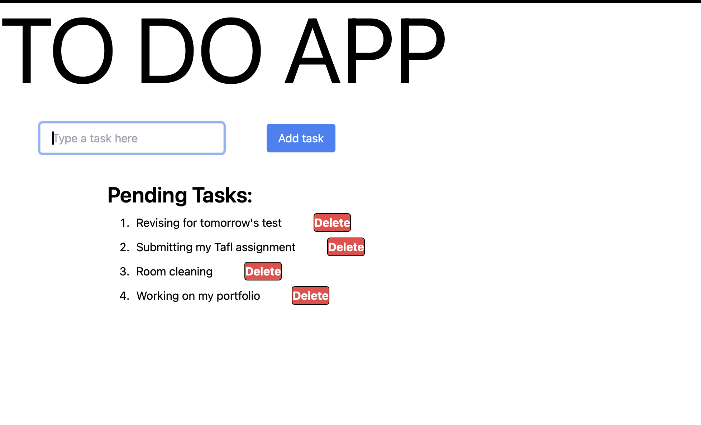

# 📝 To-Do App

A simple and interactive **To-Do List** web application built using **HTML**, **Tailwind CSS**, and **Vanilla JavaScript**.  
This app allows users to add and delete tasks with smooth fade-in and fade-out animations.

---

## ✨ Features

- ✅ Add new tasks to the list
- 🗑️ Delete tasks with a fade-out animation
- ⚡ Smooth task entry with fade-in animation
- 🎨 Styled using **Tailwind CSS**
- 🧠 Prevents adding empty tasks

---

## 🔧 Technologies Used

- **HTML** – for structure  
- **Tailwind CSS** – for utility-first styling  
- **JavaScript (DOM)** – for interactivity and animations

---

---

## 🚀 How to Run

1. Clone or download the repository.
2. Open `index.html` in any modern web browser.
3. Add tasks and manage your to-do list easily.

---

## 🧠 What I Learned

- DOM manipulation using `createElement`, `appendChild`, `querySelector`
- Handling form submissions with `preventDefault()`
- Using `setTimeout()` for triggering animations
- Applying Tailwind classes like `transition-opacity`, `opacity-0`, `opacity-100`, and `duration-1000`

---

## 📌 Project Status

✅ Completed as part of **Day 3 Mini Project** in My frontend journey.

---

> Created with 💙 by [Harsh Aggarwal]
