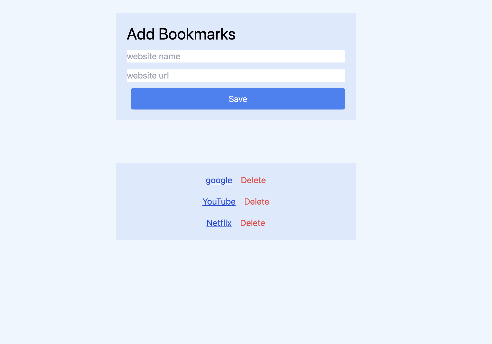

# 📅 Week 2 – Frontend Development Roadmap

**Timeline:** July 22 – August 11, 2025  
**Theme:** Fetch API, localStorage, DOM Projects, and Problem Solving (JavaScript)

---

## 📘 Overview

Week 2 focused on mastering **asynchronous JavaScript** with the Fetch API, persistent data storage using **localStorage**, hands-on DOM manipulation projects, and algorithmic problem-solving via LeetCode.  
By the end of the week, I strengthened my fundamentals and created multiple mini-projects that demonstrated real-world application of these skills.

---

## 📆 Daily Breakdown

### **🐱 Day 1 – Fetch API in Depth (August 1, 2025)**
**Project:** Cat Fact Generator  
- Learned `fetch()` with `.then()` and `async/await`
- Handled errors with `try/catch`
- Added "Loading..." indicator for better UX
- Displayed random cat facts from [catfact.ninja API](https://catfact.ninja/fact)

  
📁 [View Project Folder](./day1/project)  
📝 [View README](./day1/README.md)

---

### **💾 Day 2 – localStorage Mastery (August 2, 2025)**
**Project:** Bookmark Saver  
- Stored and retrieved bookmarks using localStorage
- Managed complex data with `JSON.stringify()` & `JSON.parse()`
- Dynamically displayed and deleted saved bookmarks
- Persistent data across page reloads

  
📁 [View Project Folder](./day2/project)  
📝 [View README](./day2/README.md)

---

### **😂 Day 3 – Saved Jokes App (August 2, 2025)**
**Project:** Saved Jokes App  
- Fetched random dad jokes with custom headers
- Prevented duplicate entries in localStorage
- Displayed saved jokes with delete functionality
- Persistent and clean UI for joke management

  
📁 [View Project Folder](./day3/project)  
📝 [View README](./day3/README.md)

---

### **⏰ Day 4 – Analog Clock & Virtual Drumstick (August 10, 2025)**
**Project 1:** Analog Clock  
- Created a functional analog clock using Date API
- Positioned clock numbers with trigonometry (`Math.sin`, `Math.cos`)
- Smooth rotation updates every second

**Project 2:** Virtual Drumstick  
- Click/keyboard-triggered drum sounds using HTML5 Audio API
- Volume control and responsive design
- Animated button states for better interactivity

  
  
📁 [Analog Clock Folder](./day4/project1)  
📁 [Virtual Drumstick Folder](./day4/project2)  
📝 [View README](./day4/readme.md)

---

### **🧮 Day 5 – LeetCode JS Practice (August 10, 2025)**
Solved 4 beginner-friendly problems:
1. **Two Sum (#1)** – Map-based lookup for O(n) solution  
2. **Fizz Buzz (#412)** – Simple divisibility checks  
3. **Merge Sorted Array (#88)** – Three-pointer in-place merge  
4. **Valid Parentheses (#20)** – Stack-based validation

📁 [View Code Files](./day5)  
📝 [View README](./day5/README.md)

---

### **🔄 Day 6 – Revision (August 11, 2025)**
- Reviewed Fetch API, localStorage, DOM manipulation, ES6+ features
- Refactored code for better readability
- Retested all projects for functionality and persistence
- Improved small UI/UX details

📝 [View README](./day6/README.md)

---

## ✅ Week Summary

- **Core Skills Strengthened:**
  - Fetch API (GET requests, error handling, async/await)
  - localStorage for persistent browser storage
  - DOM creation, updates, and event handling
  - Problem-solving with JavaScript data structures
- **Projects Completed:** 6  
- **LeetCode Problems Solved:** 4

---

## 🎯 Next Week (Week 3) Goals

- **Advanced DOM & Modular Code**
  - Use `dataset` attributes for dynamic data handling  
  - Event delegation for efficient event management  
  - Refactor projects into multiple JS modules (`export` / `import`)
- **State Management Without React**
  - Implement state objects and re-render on change  
  - Build a counter app with persistent state in localStorage
- **API Project with Search & Filters**
  - Fetch and store data in state  
  - Implement client-side search and filtering
- **JavaScript30 Practice**
  - Pick 2 projects (e.g., Array Cardio, Flex Panel Gallery, CSS Variables + JS)  
  - Write `NOTES.md` for each
- **LeetCode + Patterns**
  - Practice two pointers, sliding window, and hash maps  
  - Solve: Best Time to Buy and Sell Stock, Move Zeroes, Contains Duplicate, Plus One
- **Mini Hackathon Day**
  - Build a single-page dashboard with search, data rendering, and optional recent search persistence
- **Reflection & React Prep**
  - Write `WEEK3-LOG.md` with projects, struggles, and readiness for React  
  - Read about components, props, and state

---
