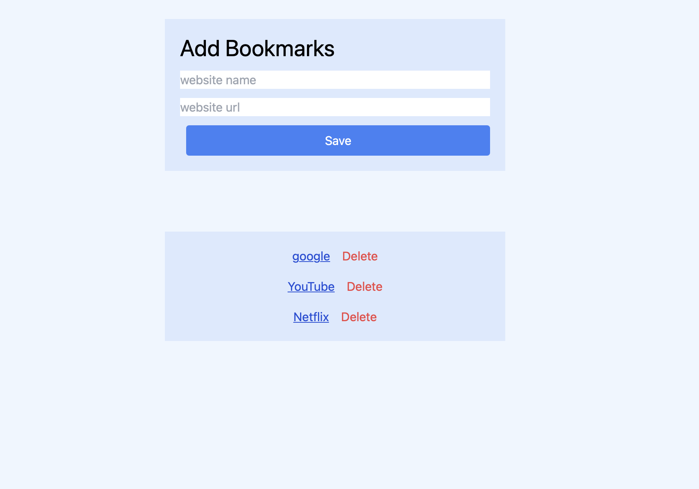

# 💾 Day 2 – localStorage Mastery (Week 2)

## 📘 What I Learned Today

- Understood how to use the `localStorage` API for storing data in the browser.
- Learned the usage of:
  - `localStorage.setItem()`
  - `localStorage.getItem()`
  - `localStorage.removeItem()`
  - `localStorage.clear()`
- Used `JSON.stringify()` and `JSON.parse()` to store and retrieve complex data (objects, arrays).
- Practiced reading from and writing to `localStorage` dynamically.
- Improved DOM manipulation and event handling in real-world scenarios.

---

## 📌 Project: Bookmark Saver

This mini project allows users to **save, display, and delete bookmarks** using localStorage.  
The bookmarks remain persistent even after the page is refreshed.

---

## 🚀 Features

- Add a **site name** and **URL** using a simple form
- Save the bookmark in localStorage
- Dynamically render the saved bookmarks
- Delete individual bookmarks on demand
- Automatically shows saved bookmarks on page reload

---

## 💻 Tech Stack

- HTML
- Tailwind CSS
- JavaScript (ES6+)
- Browser localStorage API

---## 📸 Preview

---

📁 [View Project Folder](./project/)

---

## ✅ Status

✅ Completed  
📅 Date: August 2, 2025

---
