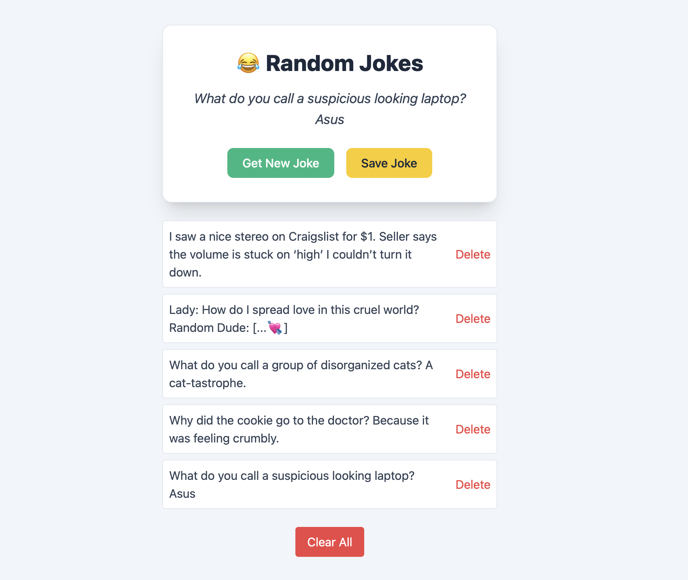

# 😂 Day 3 – Saved Jokes App (Week 2)

## 📘 What I Learned Today

- Used the `fetch()` API with custom headers to retrieve jokes from an external API.
- Learned how to handle asynchronous JavaScript using `async/await` and `try/catch`.
- Understood how to save data (jokes) persistently using `localStorage`.
- Practiced checking and preventing duplicate entries in localStorage arrays.
- Strengthened skills in DOM manipulation by dynamically rendering and deleting saved jokes.

---

## 📌 Project: Saved Jokes App

This mini project fetches dad jokes from an API and allows users to **save, view, and delete jokes** using localStorage.  
Jokes are persisted in the browser and displayed even after page reloads.

---

## 🚀 Features

- Get a new random joke with each button click
- Save favorite jokes to localStorage
- Prevents saving the same joke twice
- Display saved jokes in a clean, styled list
- Delete individual jokes or clear all at once
- Automatically renders saved jokes on page load

---

## 💻 Tech Stack

- HTML
- Tailwind CSS
- JavaScript (ES6+)
- Browser localStorage API

---

## 📸 Preview

---

📁 [View Project Folder](./project/)

---

## ✅ Status

✅ Completed  
📅 Date: August 2, 2025

---
