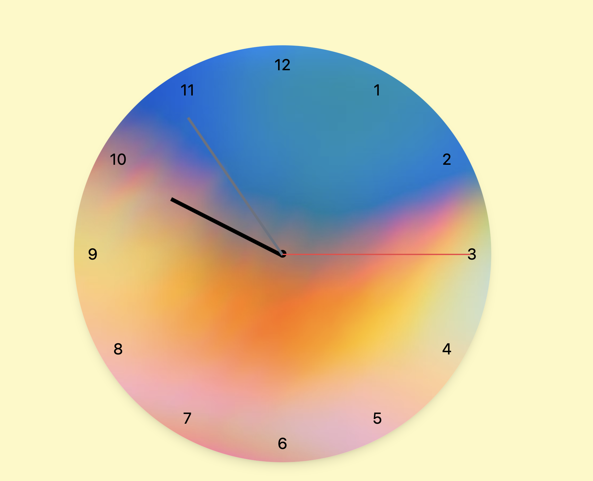

# ⏰ Day 4 – Analog Clock and Drumstick website (Week 2)

## 📘 What I Learned Today

- Practiced **absolute positioning** to place clock numbers in a circular layout.
- Used **trigonometric functions** (`Math.sin` & `Math.cos`) to calculate exact positions for each number.
- Learned how to rotate elements dynamically using **CSS transforms** (`rotate()`).
- Understood how to create **smooth real-time updates** using `setInterval()`.
- Improved DOM manipulation skills by dynamically generating clock numbers.
- Applied **JavaScript Date object** to fetch and display current time in real-time.

---

## 📌 Project: Analog Clock

This mini project creates a **functional analog clock** with hour, minute, and second hands that move in real time.  
Clock numbers are generated dynamically using JavaScript, and the background is a custom image.

---

## 🚀 Features

- Real-time clock updates every second
- Accurate rotation for hour, minute, and second hands
- Dynamically placed numbers around the clock face
- Customizable clock background image
- Smooth transitions for clock hands

---

## 💻 Tech Stack

- HTML
- Tailwind CSS
- JavaScript (ES6+)
- Date API (`new Date()`)

---

## 📸 Preview

---

📁 [View Project Folder](./project1/)

---

## ✅ Status

✅ Completed  
📅 Date: August 10, 2025
