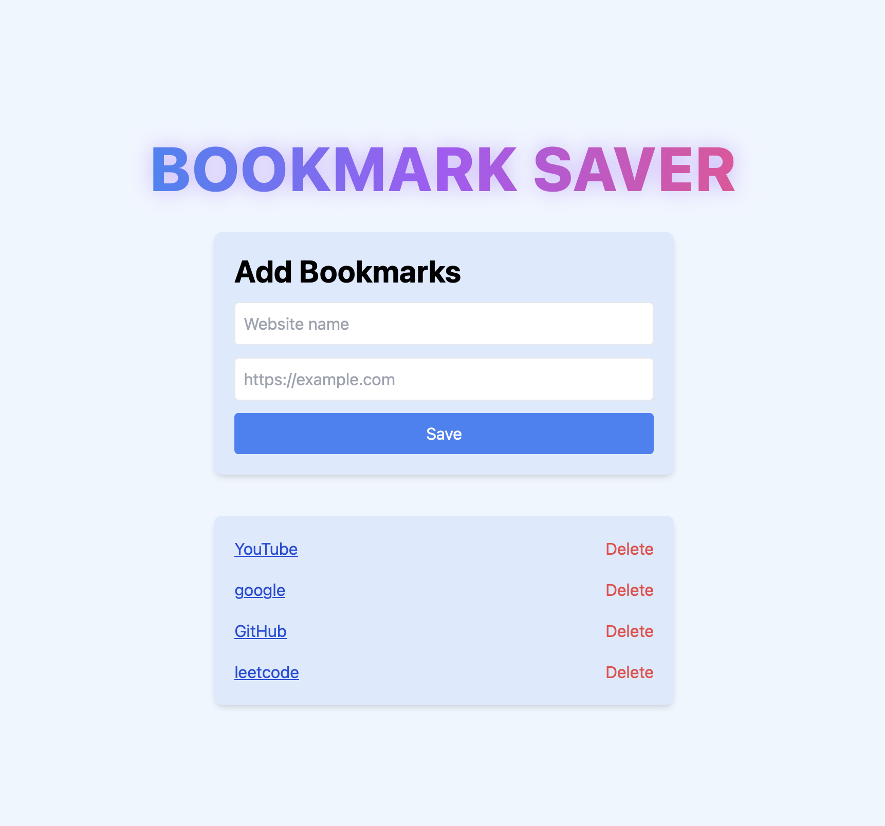

# Week 3, Day 1 – Advanced DOM + Modular Code

## 🎯 Goals
- Learn **dataset attributes** for dynamic data handling.
- Implement **event delegation** for efficient event handling.
- Separate JavaScript into **modules** using `export` / `import`.
- Refactor an old project for **cleaner, more maintainable code**.

---

## 📚 What I Learned
- How to use `data-*` attributes for identifying elements without deep DOM traversal.
- Implementing **event delegation** by adding a single listener to a parent container.
- Structuring code into **multiple modules** (`main.js`, `domutils.js`, `localstorage.js`) for better scalability.
- Replacing inline `onclick` attributes with proper event listeners.
- Using `createElement` instead of `innerHTML +=` for safer, more efficient DOM manipulation.

---

## 📝 Task
**Refactor my earlier Bookmark Saver project** to:
- Use modular JavaScript with ES6 `import` / `export`.
- Apply **event delegation** for deleting bookmarks.
- Store bookmark identifiers in **dataset attributes**.
- Improve maintainability, scalability, and performance.

---

## 🔄 Changes Made
**Before (Old Project)**  
- All JavaScript in a single `script.js` file.  
- Inline event handlers (`onclick="..."`) in HTML.  
- Bookmarks rendered using `innerHTML +=` strings.  
- Each delete button had its own separate inline handler.  
- No dataset attributes — used array indexes directly in function calls.  

**After (Refactored Project)**  
- Split code into **three separate modules**:
  - `main.js` → Handles event binding & app initialization.
  - `domutils.js` → Handles rendering & DOM event delegation.
  - `localstorage.js` → Manages all LocalStorage operations.
- Used **`dataset.index`** to store bookmark IDs.
- Implemented **event delegation** in `attachDeleteHandler()` for delete actions.
- Switched to **`createElement` + `appendChild`** instead of injecting HTML strings.
- Removed inline JS from HTML; now using `addEventListener` in JS.
- Added **form submission handling** to work with Enter key as well as the Save button.
- Improved styling & structure (rounded corners, shadows, animated heading).

---

## ✨ Features
- Add bookmarks with a name and URL.
- Visit bookmarks in a new tab.
- Delete bookmarks individually.
- Data persistence using **LocalStorage**.
- Fully responsive design with **Tailwind CSS**.

---

## 🛠️ Technology Used
- **HTML5** – Structure  
- **Tailwind CSS** – Styling  
- **JavaScript (ES6+)** – Logic & modular code  
- **LocalStorage API** – Persistent storage  

---

## 🖼️ Project Preview

📁 [View Project Folder](./task/)
